如果你准备把 **Solid 当成大型项目的长期基础框架**，尤其结合 **Three.js / 3D Editor / 游戏开发引擎**，核心原则应该是：

> **Solid 负责 UI 响应式与组件系统；业务状态、领域模型、Engine、Renderer 与 UI 解耦。**

下面是一套经评审优化后，可以直接落地的**大型 Solid + TypeScript + Three.js 3D 编辑器/引擎项目架构方案**。

---

# 一、总体架构

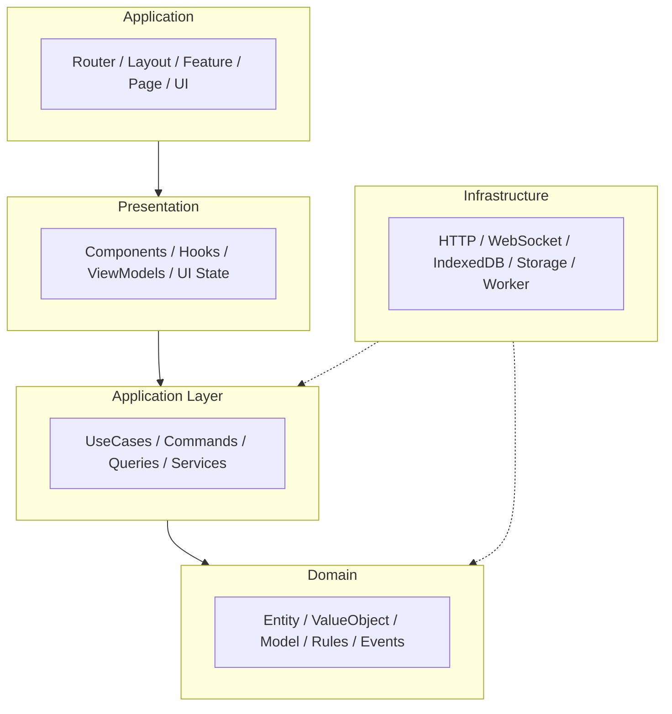

应用到 3D Engine / Editor 的具体分层：

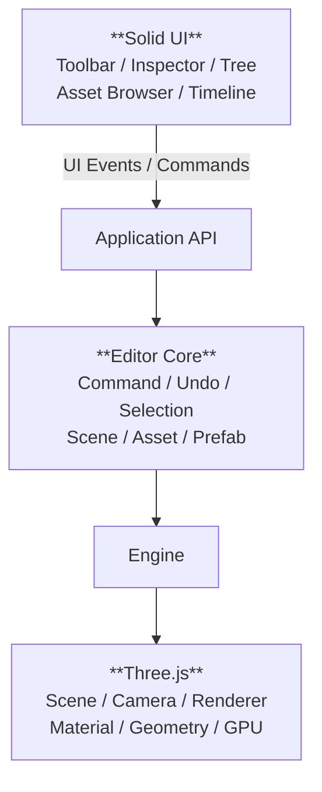

---

# 二、技术栈与 Monorepo 工程基底

## 2.1 推荐技术栈
```text
TypeScript
SolidJS
Vite
Three.js (WebGL/WebGPU)
Vitest
Playwright
ESLint
Prettier
pnpm
```

> **注意**：对于纯 3D Editor / 游戏引擎 SPA 应用，强烈推荐先采用 **`Solid + Vite`** 结构，避免一开始引入 SolidStart 带来不必要的 SSR 复杂度与 3D 渲染环境 DOM 兼容性干扰。

## 2.2 Day 1 物理边界：pnpm workspace Monorepo

为了防止项目规模扩大后，代码在单体 `src/` 中随意跨层 import 导致隐式循环依赖，建议从第一天起建立最简 Monorepo 物理隔离：

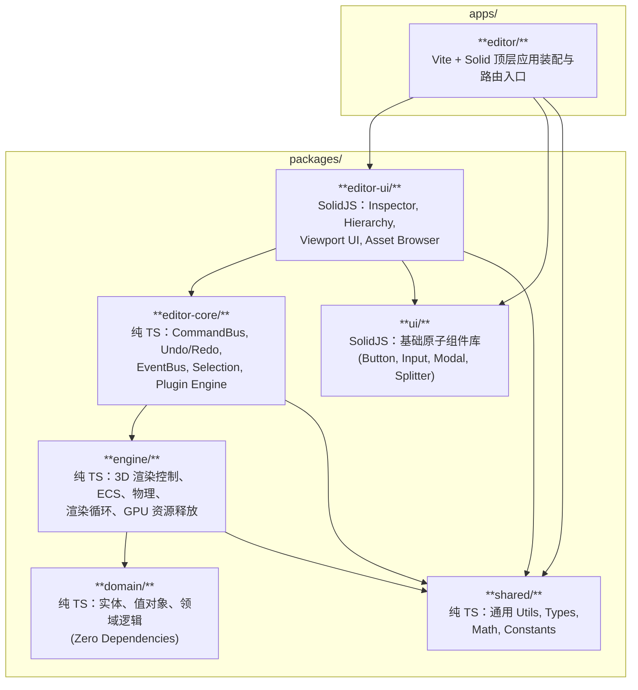

---

# 三、目录结构 (Feature-First)

大型项目必须避免按技术类型划分目录（如 `components/`, `stores/`, `utils/`），推荐**按业务能力划分**：

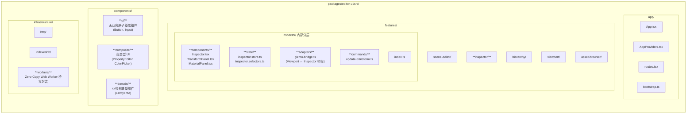

---

# 四、Solid State Architecture (状态分层)

避免"所有数据都塞入 `createStore`"或者"把所有属性都变成了 `createSignal`"。

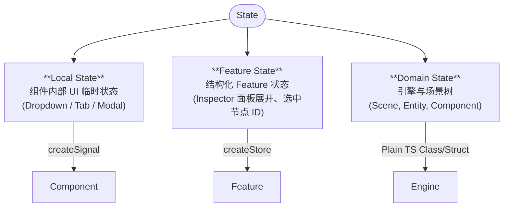

1. **Local State (`createSignal`)**：Dropdown 展开/收起、Tab 切换等组件内部 UI 临时状态。
2. **Feature State (`createStore`)**：Inspector 展开面板状态、选中节点 ID 集合等，利用 Solid `createStore` 提供属性级响应式。
3. **Domain State (Plain TS)**：引擎与场景树（Scene, Entity, Component），使用**纯 TypeScript 类/结构**维护，禁止直接绑定 Solid 响应式。

---

# 五、三频率数据模型与 Gizmo/Inspector 同步

3D 编辑器性能暴跌的主要原因是在高频更新时触动了 UI 响应式图谱。必须严格区分数据的更新频率：

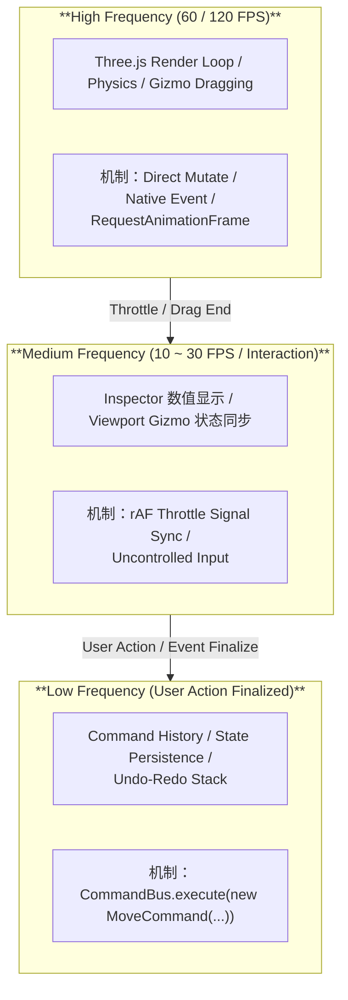

### Viewport Gizmo 与 Inspector 实时同步规范：
1. **拖拽中（Dragging）**：Gizmo 拖拽直接修改 Three.js `Object3D.position`。通过 rAF 节流（Throttle）同步更新 Inspector 的 Signal/Store，或对高频输入框采用 Uncontrolled Input + 帧刷新。**严禁在 drag 过程中每帧生成 Command**。
2. **拖拽结束（Drag End）**：提交一次完整的 `MoveEntityCommand` 到 `CommandBus`，触发撤销重做历史记录压栈与持久化。

---

# 六、Command 架构与 Undo/Redo

```ts
interface Command {
  id: string
  execute(): void
  undo(): void
}
```

修改场景树或实体属性的操作必须经过 `CommandBus`：

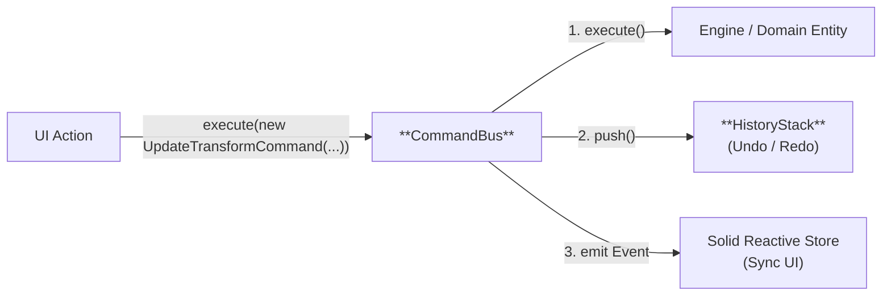

---

# 七、内存泄漏防护与 GPU 资源管理

3D 编辑器必须在第一天建立**资源销毁（Disposal）与引用计数规范**：

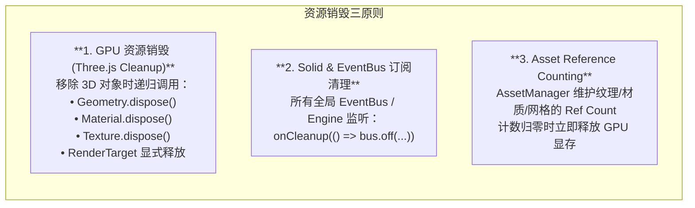

---

# 八、Web Worker 通信与零拷贝优化

涉及密集型计算（如 GLTF/FBX 解析、物理模拟、网格生成）必须提取到 Web Worker：

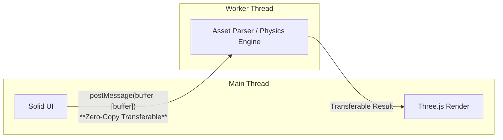

* **禁用**：在 Worker 与主线程间直接传输深层复杂 JSON 对象，避免 `Structured Clone` 阻塞主线程。
* **规范**：网格顶点、索引、纹理像素使用 `ArrayBuffer` / `TypedArray`，强制采用 **Transferable Objects** 模式实现所有权零拷贝转移。

---

# 九、Plugin Architecture (插件架构)

```ts
interface EditorPlugin {
  id: string
  name: string
  activate(ctx: PluginContext): void
  deactivate(): void
}

interface PluginContext {
  commands: CommandRegistry
  panels: PanelRegistry
  inspectors: InspectorRegistry
  importers: AssetImporterRegistry
  eventBus: EventBus
}
```

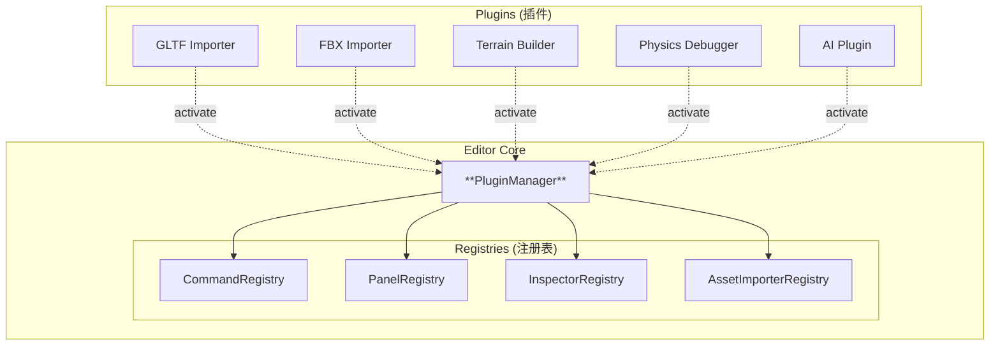

通过核心注册表管理核心能力，GLTF Importer、Terrain Builder、Physics Debugger 等均作为插件模式接入。

---

# 十、依赖规则（Dependency Rules）与黄金法则

### 10.1 严格单向依赖

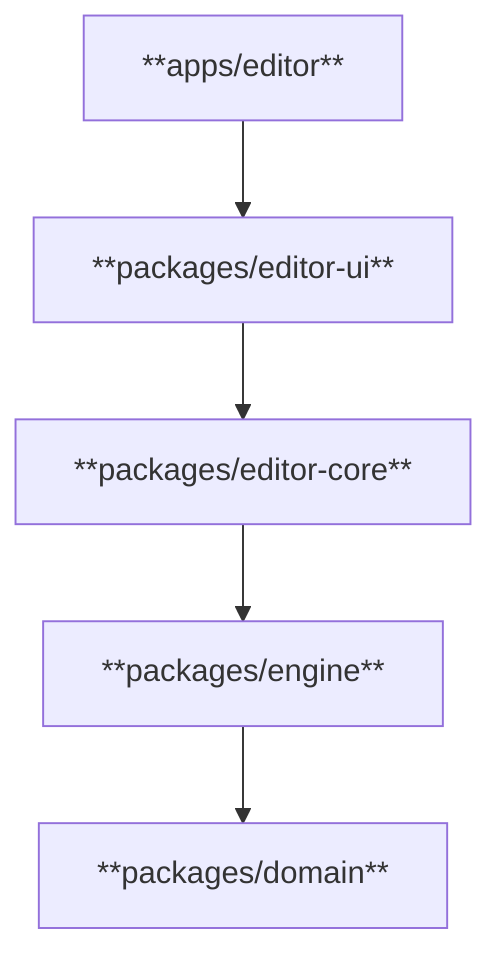

### 10.2 黄金法则（10 Golden Rules）
1. **Signal** = 组件内部 Local State。
2. **Store** = 结构化 Feature State，切勿做全局 God Store。
3. **Context** = 依赖注入容器与顶级隔离域，禁止滥用放置高频变动数据。
4. **Domain / Engine** = 框架独立（Framework Independent），绝对禁止 `import Solid`。
5. **Command** = 用户意图与历史栈基础，禁止 UI 组件直接篡改 Engine 内部状态。
6. **Three.js Scene Graph ≠ Solid State**，Three.js 对象图由 Engine 管理，Solid 只观察 metadata 和 selected 状态。
7. **高频数据（60FPS）禁止入 UI State**，必须使用三频率同步模型。
8. **GPU 资源与事件必须成对销毁**，显式管理 `.dispose()` 与 `onCleanup`。
9. **Worker 通信优先 Transferable**，拒绝大规模 JSON 序列化传输。
10. **Day 1 设立物理边界**，使用 Monorepo 物理隔离防范循环依赖。

---

# 十一、项目实施路线图 (Roadmap)

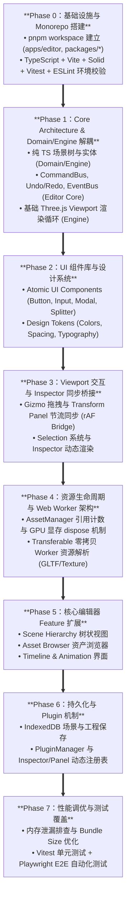
